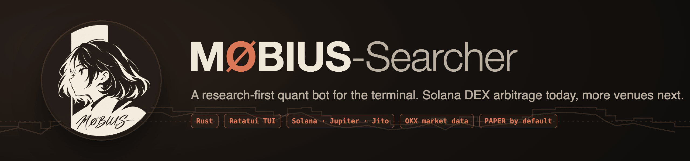
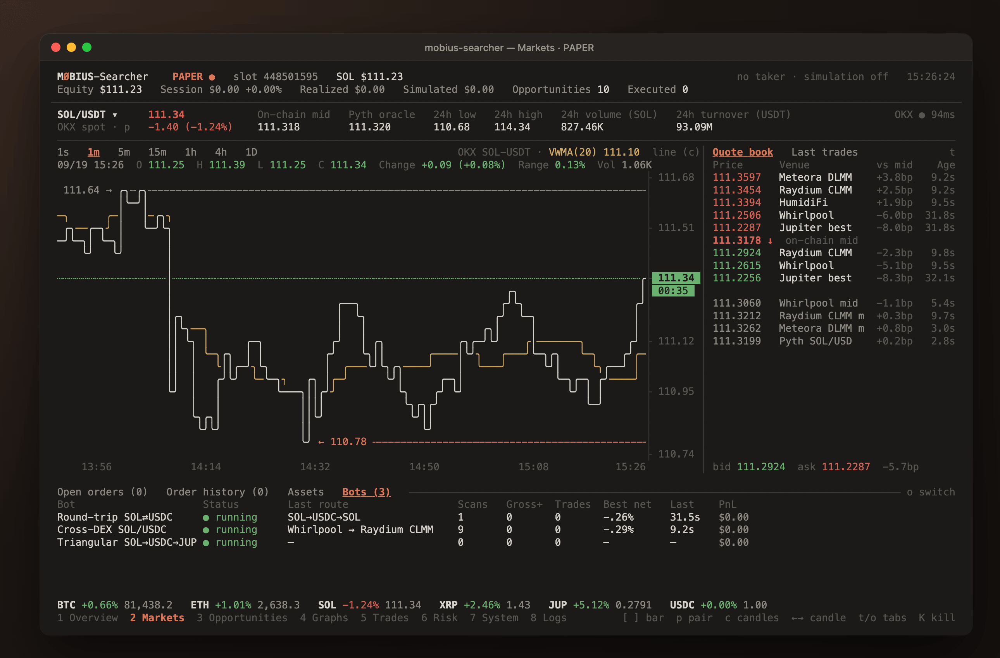
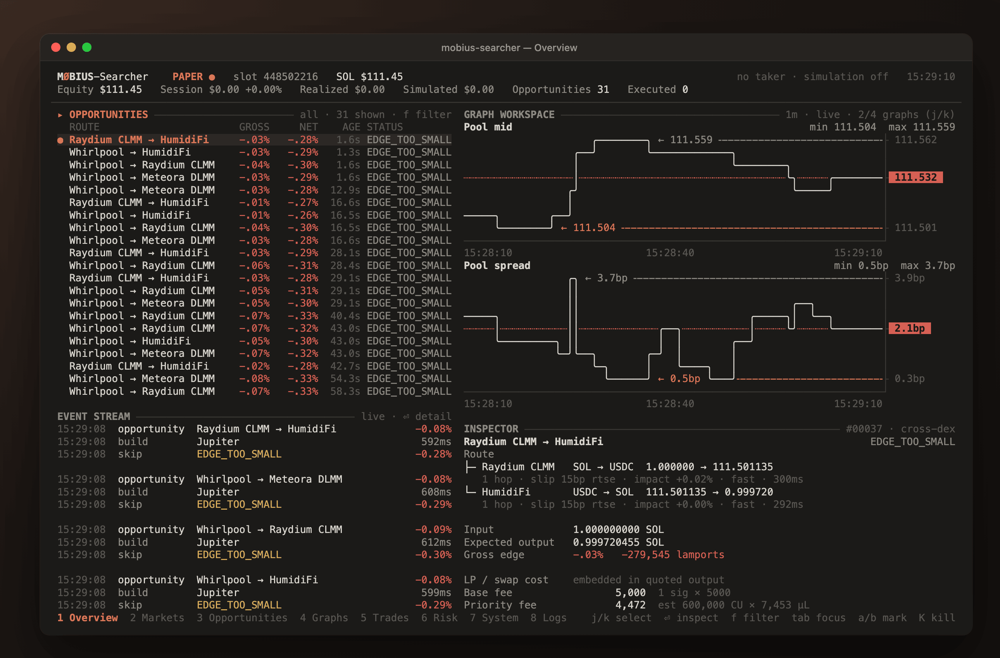
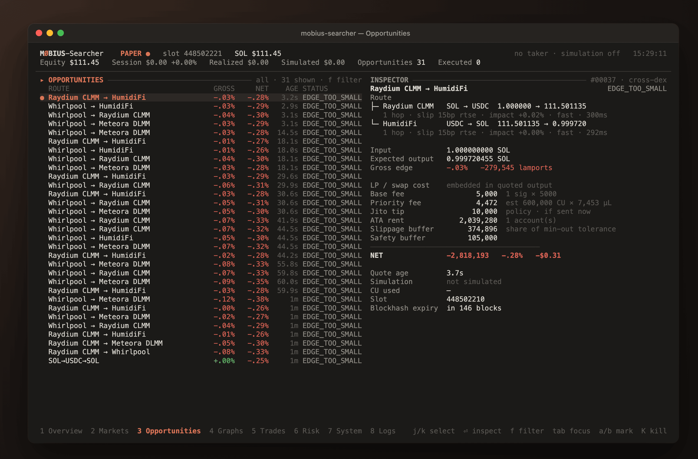
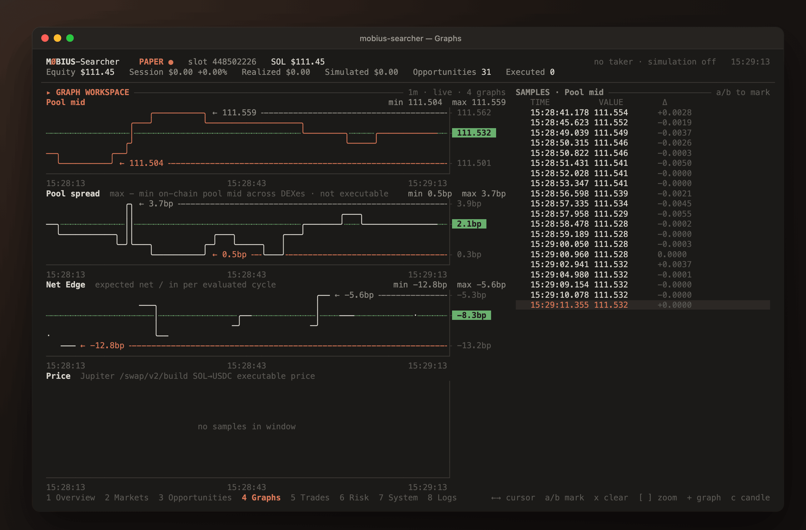
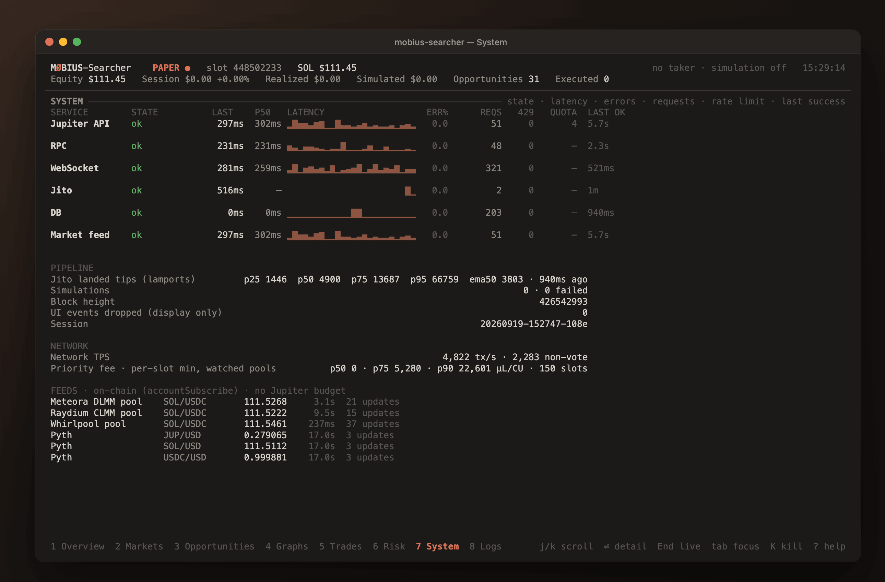
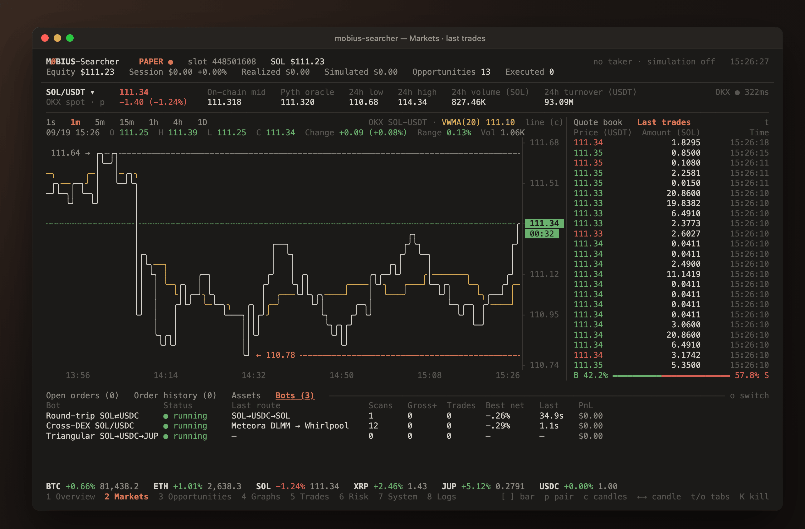
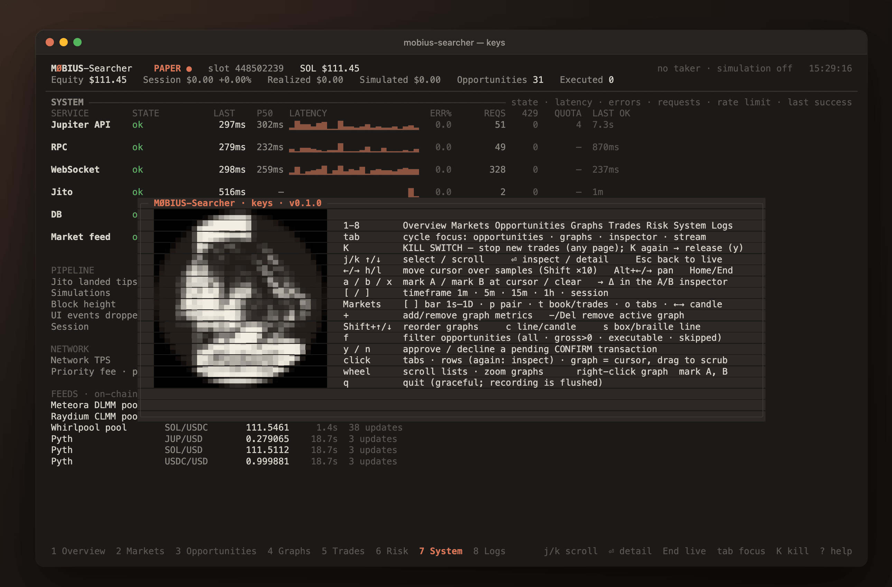
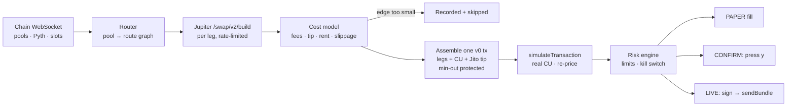

<p align="center">
  
</p>

<p align="center">
  <a href="CHANGELOG.md"></a>
  <a href="https://www.rust-lang.org"></a>
  <a href="https://ratatui.rs"></a>
  <a href="#license"></a>
  <a href="#safety-model"></a>
  <a href="README.zh-CN.md"></a>
</p>

<p align="center">
  <a href="#install">Install</a> ·
  <a href="#quick-start">Quick start</a> ·
  <a href="#terminal-ui">Terminal UI</a> ·
  <a href="#how-it-works">How it works</a> ·
  <a href="docs/CONFIGURATION.md">Configuration</a> ·
  <a href="#documentation">Docs</a> ·
  <a href="CHANGELOG.md">Changelog</a>
</p>

**MØBIUS-Searcher is a research-first quant bot that lives in your terminal.** It
watches Solana DEXes in real time, prices every arbitrage route with real
Jupiter quotes, builds the actual transaction and simulates it on mainnet — and
then tells you, with numbers, why it would or would not trade. Venues are
configured side by side: Solana executes today, OKX supplies market data, more
venues come next.

> [!WARNING]
> **Not a money printer.** In 3,091 real evaluations and 2,333 mainnet
> simulations it found **0** executable opportunities at its default
> configuration ([results](docs/PAPER_RUN.md)). It runs in **PAPER** by default
> — real data, real simulations, nothing signed or sent. CONFIRM and LIVE are
> locked behind explicit gates and have never sent a transaction. Nothing here
> is financial advice.

<p align="center">
  
  <br><sub>The Markets page on live data (PAPER). Price, 24 h stats and candles from OKX; the quote book is what the bot can actually trade on-chain.</sub>
</p>

<table>
<tr><td><b>Simulation-first</b></td><td>Every route becomes one real v0 transaction (all legs, compute budget, Jito tip), simulated on mainnet before anything could be sent. A simulation error or a thin edge means it is never sent.</td></tr>
<tr><td><b>Honest accounting</b></td><td>Integer money everywhere. Base fee, priority fee, Jito tip, ATA rent, slippage share and a safety buffer are costed per route; every evaluation is recorded — including the losing ones and why they were skipped.</td></tr>
<tr><td><b>Event-driven scheduling</b></td><td>Pool and oracle accounts stream in over the chain WebSocket; a dependency graph spends the Jupiter rate limit only where the market moved. 30 % fewer requests, zero 429s, quotes 4× younger at decision time.</td></tr>
<tr><td><b>A terminal UI worth using</b></td><td>Eight pages built with Ratatui: an exchange-style Markets view, opportunities with an inspector, stacked graphs with cursors and A/B deltas, risk, system health, logs. Mouse and keyboard.</td></tr>
<tr><td><b>Gated execution</b></td><td>PAPER → CONFIRM (approve each transaction with <code>y</code>) → LIVE, each behind explicit configuration, a risk engine, an on-chain minimum output and a kill switch.</td></tr>
<tr><td><b>Record and replay</b></td><td>Every session goes to a local SQLite database (compressed, pruned automatically) and replays through the exact same UI. Reports summarise edges, costs and simulation failures.</td></tr>
<tr><td><b>Multi-venue config</b></td><td>Layered TOML (built-in → shared → yours → flags), <code>[venues.*]</code> side by side, secrets only as environment-variable names, <code>--doctor</code> checks every endpoint.</td></tr>
</table>

---

## Where it stands

| | |
|---|---|
| **PAPER results** | 3 soak runs · 3,091 evaluations · 2,333 mainnet simulations · **0 executable** · median gross edge ≈ −3.5 bp, net ≈ −8.9 bp ([docs/PAPER_RUN.md](docs/PAPER_RUN.md)) |
| **Scheduling** | event-driven by default: vs. round-robin, 30 % fewer requests, 0 × 429, quotes at decision time p50 2.6 s → 0.64 s. *Market change → usable quote did not get faster:* the Jupiter rate limit is the bottleneck ([docs/LATENCY.md](docs/LATENCY.md)) |
| **Data freshness** | pool updates arrive 0–2 slots behind the chain head on the default RPC |
| **CONFIRM / LIVE** | implemented and unit-tested, locked by default, **no transaction ever sent** |
| **Venues** | Solana: execution. OKX: market data only (no order connector yet) |

## Install

```bash
curl -fsSL https://raw.githubusercontent.com/mangiapanejohn-dev/MOBIUS-Searcher/main/scripts/install.sh | sh
```

<details>
<summary><b>Windows · npm · Cargo · from source</b></summary>

Windows (PowerShell):

```powershell
irm https://raw.githubusercontent.com/mangiapanejohn-dev/MOBIUS-Searcher/main/scripts/install.ps1 | iex
```

npm (downloads the prebuilt binary for your platform):

```bash
npm install -g mobius-searcher
```

Cargo (Rust ≥ 1.91):

```bash
cargo install --git https://github.com/mangiapanejohn-dev/MOBIUS-Searcher mobius-searcher --locked
```

From source:

```bash
git clone https://github.com/mangiapanejohn-dev/MOBIUS-Searcher && cd MOBIUS-Searcher && cargo build --release
```

</details>

Prebuilt binaries for macOS (Apple silicon, Intel), Linux (x86_64, ARM64) and
Windows (x64) are on the [Releases](https://github.com/mangiapanejohn-dev/MOBIUS-Searcher/releases)
page; every installer verifies `SHA256SUMS`. Details, paths and uninstalling:
[docs/INSTALL.md](docs/INSTALL.md).

> [!TIP]
> Use a GPU terminal with an image protocol: [Ghostty](https://ghostty.org/)
> on macOS and Linux, [Warp](https://www.warp.dev/) on Windows. The logo then
> renders as a real image; everything else works in any modern terminal.

## Quick start

```bash
mobius-searcher --doctor        # config, secrets (names only), proxy, every endpoint
mobius-searcher                 # first run opens a short setup; PAPER by default
mobius-searcher --report latest # what happened, with numbers
mobius-searcher --replay latest # the same UI over the recording
```

No keys are needed to start: Jupiter works keyless at a lower rate, the public
Solana RPC is the default. An optional `JUPITER_API_KEY` goes in
`~/.config/mobius/.env`. More in [docs/USAGE.md](docs/USAGE.md).

## Safety model

| Mode | Market data | Transactions | Sent | Unlocked by |
|---|---|---|---|---|
| **PAPER** (default) | real | assembled + simulated on mainnet | never | — |
| **CONFIRM** | real | assembled + simulated | after you press `y`, one by one | `execution.live_enabled = true` + a keypair file + `--mode confirm` |
| **LIVE** | real | assembled + simulated | automatically, when simulation and risk pass | the same + `--mode live` |

Before anything is sent: simulation must show a profit after all costs; the
final swap carries an on-chain minimum output so a price move reverts instead
of losing; the risk engine checks size, equity share, daily loss, fee reserve
and staleness; **`K` stops new submissions from any page.** The private key is
a `chmod 600` file outside the repository, never an environment variable.
See [SECURITY.md](SECURITY.md) and [docs/LIVE_CHECKLIST.md](docs/LIVE_CHECKLIST.md).

## Terminal UI

<table>
<tr>
<td width="50%"><br><sub><b>1 Overview</b> — opportunities, graph workspace, event stream, inspector</sub></td>
<td width="50%"><br><sub><b>3 Opportunities</b> — every route and why it was skipped</sub></td>
</tr>
<tr>
<td><br><sub><b>4 Graphs</b> — stacked metrics, cursor, A/B deltas, samples</sub></td>
<td><br><sub><b>7 System</b> — every connection: state, latency, errors, rate limits</sub></td>
</tr>
<tr>
<td><br><sub><b>2 Markets</b> — last trades and buy/sell share</sub></td>
<td><br><sub><b>?</b> — keys, with the logo</sub></td>
</tr>
</table>

| Keys | |
|---|---|
| `1`–`8` pages · `Tab` focus · `?` help · `q` quit | `K` **kill switch** (any page) |
| `←/→` cursor · `[ ]` timeframe / candle bar · `c` line / candles | `a` `b` `x` A/B markers · `+` graphs · `f` filter |
| Markets: `p` pair · `t` quote book / trades · `o` bottom tabs | `y` / `n` approve / decline in CONFIRM |

Full reference: [docs/USAGE.md](docs/USAGE.md#terminal-ui).

## How it works



Every step emits an event: to the UI through a bounded channel (the UI can
never stall the engine) and to the recorder, which writes a compressed,
replayable log. Market data that needs no executable quote — pool mids, Pyth
prices, priority fees, Jito tips — comes from sources that cost no Jupiter
budget. Design decisions: [docs/ARCHITECTURE.md](docs/ARCHITECTURE.md).

## Configuration

Settings layer from built-in defaults → `config/mobius.toml` → your
`~/.config/mobius/config.toml` → command-line flags. Secrets never go in a
config file, only their variable names; values come from the environment or
`~/.config/mobius/.env`.

```toml
# ~/.config/mobius/config.toml — only what you change
[risk]
max_trade_lamports = 10000000                 # 0.01 SOL

[venues.okx]
markets = ["BTC-USDT", "ETH-USDT"]            # the Markets page cycles these
```

```bash
mobius-searcher --print-config   # every effective value and where it came from
```

Every section, venues and secrets: [docs/CONFIGURATION.md](docs/CONFIGURATION.md).

## Workspace

| Crate | Purpose |
|---|---|
| `crates/core` | domain model, integer money, cost & profit engine, layered config, events (no IO) |
| `crates/telemetry` | service health, learned rate-limit window, 429 backoff, latency book, proxy discovery |
| `crates/market` | Solana JSON-RPC, chain WebSocket (slots, pool and Pyth accounts), hot path, network stats |
| `crates/jupiter` | Swap API V2 client and adapters |
| `crates/jito` | block engine client, tip policies |
| `crates/strategy` | round-trip, cross-DEX and triangular strategies, pricing |
| `crates/risk` | risk engine, kill switch |
| `crates/execution` | router, v0 assembly, simulation, pipeline, executors, wallet |
| `crates/storage` | SQLite recorder (compressed log, retention), replay, reports |
| `crates/tui` | Ratatui UI: pages, Markets view, charts, inspector |
| `apps/mobius-searcher` | the `mobius-searcher` binary, setup, `--doctor` |

## Documentation

| Document | What's covered |
|---|---|
| [INSTALL](docs/INSTALL.md) | install methods, platforms, file locations, terminals |
| [USAGE](docs/USAGE.md) | first run, modes, command line, pages and keys, replay |
| [CONFIGURATION](docs/CONFIGURATION.md) | layers, every section, venues, secrets |
| [ARCHITECTURE](docs/ARCHITECTURE.md) | design decisions, crates, runtime topology |
| [LATENCY](docs/LATENCY.md) | scheduling, rate limits, measured A/B results |
| [STORAGE](docs/STORAGE.md) | what is recorded, compression, retention |
| [PAPER_RUN](docs/PAPER_RUN.md) | the PAPER soak results in full |
| [RESEARCH](docs/RESEARCH.md) | API research behind the design |
| [LIVE_CHECKLIST](docs/LIVE_CHECKLIST.md) | everything that must be true before LIVE |
| [SECURITY](SECURITY.md) | secrets, keys, execution gates, reporting |

## Development

```bash
cargo fmt --all && cargo clippy --workspace --all-targets -- -D warnings
```

```bash
cargo test --workspace
```

```bash
mobius-searcher --replay latest --snapshot 120x40 --out shots/   # render pages to .txt/.html
```

CI builds and tests on Linux, macOS and Windows. Live smoke tests (Jupiter,
OKX) are `#[ignore]`d and run with `-- --ignored`.

## Roadmap

Planned, **not implemented** in 0.1.0: an OKX order connector, Binance, EVM-chain
DEXes, and moving the Solana stack under `[venues.solana]`. See the
[CHANGELOG](CHANGELOG.md) for what is in this release.

## License

Licensed under either of [Apache License, Version 2.0](LICENSE-APACHE) or
[MIT license](LICENSE-MIT) at your option.

<p align="center"><sub>MØBIUS-Searcher is research software. Trading can lose money. Use it at your own risk.</sub></p>
