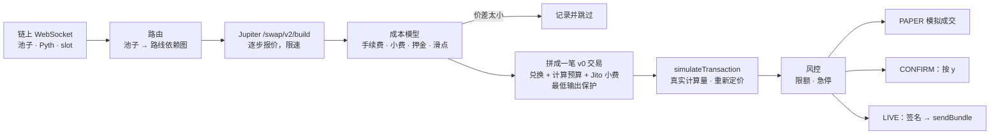

<p align="center">
  
</p>

<p align="center">
  <a href="https://github.com/mangiapanejohn-dev/MOBIUS-Searcher/releases/tag/v0.1.0"></a>
  <a href="https://github.com/mangiapanejohn-dev/MOBIUS-Searcher/actions/workflows/ci.yml"></a>
  <a href="https://github.com/mangiapanejohn-dev/MOBIUS-Searcher/stargazers"></a>
  <a href="https://github.com/mangiapanejohn-dev/MOBIUS-Searcher/issues"></a>
  <a href="https://www.rust-lang.org"></a>
  <a href="https://ratatui.rs"></a>
  <a href="#许可证"></a>
  <a href="#安全模型"></a>
  <a href="README.md"></a>
</p>

<p align="center">
  <a href="#安装">安装</a> ·
  <a href="#快速开始">快速开始</a> ·
  <a href="#终端界面">终端界面</a> ·
  <a href="#工作原理">工作原理</a> ·
  <a href="docs/CONFIGURATION.md">配置</a> ·
  <a href="#文档">文档</a> ·
  <a href="ROADMAP.md">Roadmap</a> ·
  <a href="CONTRIBUTING.md">参与贡献</a> ·
  <a href="CHANGELOG.md">更新日志</a>
</p>

## 在终端里做真实的 Solana 套利研究

**真实 DEX 报价。真实交易构建。真实主网模拟。默认 PAPER。**

MØBIUS-Searcher 实时监控 Solana DEX，用 Jupiter 给路线定价，构建真实 v0
transaction，在主网上模拟执行，然后用数字解释：这条路线为什么能做，或者为什么
根本不应该做。

| **3,091** | **2,333** | **0** |
|:---:|:---:|:---:|
| 次真实评估 | 次主网模拟 | 个默认配置下可执行的机会 |

很多交易 Bot 的展示从“赚钱截图”开始。MØBIUS-Searcher 从更难的问题开始：
**把手续费、滑点、Jito tip、ATA rent、报价新鲜度、交易构建和主网模拟全部算进去之后，
这个价差还是真的吗？**

目前默认配置下，答案是：**不是。** 这正是这个项目有价值的地方。它不仅记录“看起来
赚钱”的路线，也记录那些最后被证明不可执行的路线，让它更像一个可复现的 Solana
execution / MEV 研究工具，而不是收益承诺。

> [!WARNING]
> **它不是印钞机。** 当前 PAPER 结果包含 3,091 次真实评估、2,333 次主网模拟，
> **0 个可执行机会**（[完整结果](docs/PAPER_RUN.md)）。PAPER 使用真实市场数据和真实
> 模拟，但不会签名或发送交易。CONFIRM 和 LIVE 都需要显式开启，至今没有发出过任何
> 一笔交易。本项目的任何内容都不构成投资建议。

<p align="center">
  
  <br><sub>行情页，实时数据（PAPER）。价格、24 小时统计和 K 线来自 OKX；报价簿是机器人在链上真正能成交的价格。</sub>
</p>

<table>
<tr><td><b>模拟优先</b></td><td>每条路线都会变成一笔真实的 v0 交易（所有兑换步骤、计算预算、Jito 小费），发送之前先在主网上模拟。模拟出错或利润太薄，就永远不会发出。</td></tr>
<tr><td><b>诚实记账</b></td><td>全程整数记账。基础手续费、优先费、Jito 小费、开户押金、滑点预留和安全缓冲逐条计入成本；每一次评估都会记录，包括亏损的那些以及被跳过的原因。</td></tr>
<tr><td><b>事件驱动调度</b></td><td>池子和预言机账户通过链上 WebSocket 实时推送；依赖图只在行情变化的地方花 Jupiter 的请求额度。请求减少 30%，限流 0 次，决策时的报价新鲜 4 倍。</td></tr>
<tr><td><b>好用的终端界面</b></td><td>基于 Ratatui 的 8 个页面：交易所风格的行情页、带检查器的机会列表、可对比 A/B 的叠加图表、风控、系统健康、日志。鼠标和键盘都能用。</td></tr>
<tr><td><b>层层把关的执行</b></td><td>PAPER → CONFIRM（每笔按 <code>y</code> 确认）→ LIVE，每一步都要明确配置，还有风控引擎、链上最低输出保护和急停开关。</td></tr>
<tr><td><b>录制与回放</b></td><td>每次运行都记录到本地 SQLite 数据库（压缩存储、自动清理），并能用同一个界面原样回放；报告汇总价差、成本和模拟失败原因。</td></tr>
<tr><td><b>多交易所配置</b></td><td>分层 TOML（内置 → 共享 → 你的 → 命令行），<code>[venues.*]</code> 并列配置，密钥只写环境变量名，<code>--doctor</code> 检查每一个连接。</td></tr>
</table>

---

## 现状

| | |
|---|---|
| **模拟盘结果** | 3 次长时间测试 · 3,091 次评估 · 2,333 次主网模拟 · **0 次可执行** · 毛利中位数 ≈ −3.5 bp，净利 ≈ −8.9 bp（[docs/PAPER_RUN.md](docs/PAPER_RUN.md)） |
| **调度** | 默认事件驱动：相比轮询，请求少 30%，限流 0 次，决策时报价的年龄中位数从 2.6 秒降到 0.64 秒。*但从行情变化到拿到可用报价并没有变快*，瓶颈是 Jupiter 的请求限额（[docs/LATENCY.md](docs/LATENCY.md)） |
| **数据新鲜度** | 默认 RPC 下，池子更新比链上最新区块慢 0–2 个 slot |
| **CONFIRM / LIVE** | 已实现并有单元测试，默认锁住，**从未发出过交易** |
| **交易所** | Solana：执行。OKX：仅行情数据（还没有下单连接器） |

## 参与研究与贡献

MØBIUS-Searcher 最有价值的外部贡献不是“再加一个看起来很赚钱的策略”，而是让现有结论更容易被**复现、验证、推翻或解释**。

目前最需要的方向：

- 在不同 RPC / 地区复现数据新鲜度和延迟结果；
- 复现 Jupiter 调度 A/B 测试；
- 验证 Windows / Linux / 不同终端兼容性；
- 补充执行、成本模型和异常路径的回归测试；
- 改进某一类“为什么被跳过”的解释和报告。

入口：

- [Roadmap](ROADMAP.md)
- [贡献指南](CONTRIBUTING.md)
- [公开 Issues](https://github.com/mangiapanejohn-dev/MOBIUS-Searcher/issues)
- [安全问题私密报告](SECURITY.md)

复现失败、与现有结果冲突的实验同样欢迎——只要方法和环境写清楚。

## 安装

```bash
curl -fsSL https://raw.githubusercontent.com/mangiapanejohn-dev/MOBIUS-Searcher/main/scripts/install.sh | sh
```

<details>
<summary><b>Windows · npm · Cargo · 从源码编译</b></summary>

Windows（PowerShell）：

```powershell
irm https://raw.githubusercontent.com/mangiapanejohn-dev/MOBIUS-Searcher/main/scripts/install.ps1 | iex
```

npm（自动下载对应平台的预编译程序）：

```bash
npm install -g mobius-searcher
```

Cargo（Rust ≥ 1.91）：

```bash
cargo install --git https://github.com/mangiapanejohn-dev/MOBIUS-Searcher mobius-searcher --locked
```

从源码编译：

```bash
git clone https://github.com/mangiapanejohn-dev/MOBIUS-Searcher && cd MOBIUS-Searcher && cargo build --release
```

</details>

macOS（Apple 芯片、Intel）、Linux（x86_64、ARM64）、Windows（x64）的预编译程序在
[Releases](https://github.com/mangiapanejohn-dev/MOBIUS-Searcher/releases) 页面，
所有安装方式都会校验 `SHA256SUMS`。详细说明、文件位置和卸载方法见
[docs/INSTALL.md](docs/INSTALL.md)。

> [!TIP]
> 推荐使用支持图片协议的 GPU 终端：macOS 和 Linux 用 [Ghostty](https://ghostty.org/)，
> Windows 用 [Warp](https://www.warp.dev/)。这样 logo 会显示成真正的图片；其余功能在
> 任何现代终端里都一样。

## 快速开始

```bash
mobius-searcher --doctor        # 检查配置、密钥（只看名字）、代理和每一个连接
mobius-searcher                 # 第一次运行会打开一个简短的设置向导；默认模拟盘
mobius-searcher --report latest # 这次运行发生了什么，用数字说话
mobius-searcher --replay latest # 用同一个界面回放录制
```

开始不需要任何密钥：Jupiter 不用 key 也能用（速率低一些），默认用公共的 Solana
RPC。可选的 `JUPITER_API_KEY` 放在 `~/.config/mobius/.env`。更多见
[docs/USAGE.md](docs/USAGE.md)。

## 安全模型

| 模式 | 行情数据 | 交易 | 是否发送 | 解锁条件 |
|---|---|---|---|---|
| **PAPER**（默认） | 真实 | 在主网上拼装并模拟 | 从不 | — |
| **CONFIRM** | 真实 | 拼装并模拟 | 你逐笔按 `y` 后才发 | `execution.live_enabled = true` + 私钥文件 + `--mode confirm` |
| **LIVE** | 真实 | 拼装并模拟 | 模拟和风控都通过时自动发送 | 同上 + `--mode live` |

发送之前：模拟必须显示扣除所有成本后仍然赚钱；最后一步兑换带有链上最低输出，价格
变动时交易会回滚而不是亏钱；风控检查金额、占资金比例、当日亏损、手续费预留和数据
新鲜度；**任何页面按 `K` 都能立刻停止发送新交易。** 私钥是仓库之外、权限为
`chmod 600` 的文件（别人可读的私钥文件会被拒绝；Windows 上程序无法检查文件权限，请把私钥放在
你的用户目录下，例如 `%USERPROFILE%\.config\mobius\wallets\`，这样只有你的账户能读），绝不放在环境变量里。见 [SECURITY.md](SECURITY.md) 和
[docs/LIVE_CHECKLIST.md](docs/LIVE_CHECKLIST.md)。

## 终端界面

<table>
<tr>
<td width="50%"><br><sub><b>1 总览</b> — 机会、图表区、事件流、检查器</sub></td>
<td width="50%"><br><sub><b>3 机会</b> — 每条路线以及被跳过的原因</sub></td>
</tr>
<tr>
<td><br><sub><b>4 图表</b> — 叠加指标、光标、A/B 对比、采样表</sub></td>
<td><br><sub><b>7 系统</b> — 每条连接的状态、延迟、错误、限流</sub></td>
</tr>
<tr>
<td><br><sub><b>2 行情</b> — 最新成交和买卖占比</sub></td>
<td><br><sub><b>?</b> — 按键说明，附 logo</sub></td>
</tr>
</table>

| 按键 | |
|---|---|
| `1`–`8` 翻页 · `Tab` 切换面板 · `?` 帮助 · `q` 退出 | `K` **急停**（任何页面） |
| `←/→` 光标 · `[ ]` 时间范围 / K 线周期 · `c` 折线 / K 线 | `a` `b` `x` A/B 标记 · `+` 加图表 · `f` 筛选 |
| 行情页：`p` 交易对 · `t` 报价簿 / 最新成交 · `o` 底部标签 | CONFIRM 模式：`y` / `n` 确认 / 拒绝 |

完整说明：[docs/USAGE.md](docs/USAGE.md#terminal-ui)。

## 工作原理



每一步都会产生事件：一路经有界通道送到界面（界面永远拖不慢引擎），一路送到录制
线程，写成压缩、可回放的日志。不需要可执行报价的行情数据（池子中间价、Pyth 价格、
优先费、Jito 小费）来自不消耗 Jupiter 额度的数据源。设计决策见
[docs/ARCHITECTURE.md](docs/ARCHITECTURE.md)。

## 配置

配置分层：内置默认值 → `config/mobius.toml` → 你的 `~/.config/mobius/config.toml`
→ 命令行参数。密钥从不写进配置文件，只写环境变量名；值来自环境变量或
`~/.config/mobius/.env`。

```toml
# ~/.config/mobius/config.toml — 只写你要改的
[risk]
max_trade_lamports = 10000000                 # 0.01 SOL

[venues.okx]
markets = ["BTC-USDT", "ETH-USDT"]            # 行情页按 p 在这些交易对之间切换
```

```bash
mobius-searcher --print-config   # 每一项实际生效的值，以及它来自哪一层
```

所有配置段、交易所和密钥说明：[docs/CONFIGURATION.md](docs/CONFIGURATION.md)。

## 代码结构

| Crate | 作用 |
|---|---|
| `crates/core` | 领域模型、整数记账、成本和利润引擎、分层配置、事件（无 IO） |
| `crates/telemetry` | 服务健康、自学习的限流窗口、429 退避、延迟统计、代理发现 |
| `crates/market` | Solana JSON-RPC、链上 WebSocket（slot、池子和 Pyth 账户）、热路径、网络统计 |
| `crates/jupiter` | Swap API V2 客户端和适配器 |
| `crates/jito` | block engine 客户端、小费策略 |
| `crates/strategy` | 往返、跨 DEX、三角套利策略，定价 |
| `crates/risk` | 风控引擎、急停开关 |
| `crates/execution` | 路由、v0 交易拼装、模拟、流水线、执行器、钱包 |
| `crates/storage` | SQLite 录制（压缩日志、保留策略）、回放、报告 |
| `crates/tui` | Ratatui 界面：各页面、行情页、图表、检查器 |
| `apps/mobius-searcher` | `mobius-searcher` 程序本体、设置向导、`--doctor` |

## 文档

| 文档 | 内容 |
|---|---|
| [INSTALL](docs/INSTALL.md) | 安装方式、支持平台、文件位置、终端推荐 |
| [USAGE](docs/USAGE.md) | 首次运行、模式、命令行、页面和按键、回放 |
| [CONFIGURATION](docs/CONFIGURATION.md) | 配置分层、每个配置段、交易所、密钥 |
| [ARCHITECTURE](docs/ARCHITECTURE.md) | 设计决策、crate 划分、运行时结构 |
| [LATENCY](docs/LATENCY.md) | 调度、限流、实测 A/B 结果 |
| [STORAGE](docs/STORAGE.md) | 记录什么、压缩、保留策略 |
| [PAPER_RUN](docs/PAPER_RUN.md) | 模拟盘长时间测试的完整结果 |
| [RESEARCH](docs/RESEARCH.md) | 设计背后的 API 调研 |
| [LIVE_CHECKLIST](docs/LIVE_CHECKLIST.md) | 开启实盘前必须满足的所有条件 |
| [SECURITY](SECURITY.md) | 密钥、私钥、执行关卡、漏洞报告 |

文档正文目前为英文。

## 开发

```bash
cargo fmt --all && cargo clippy --workspace --all-targets -- -D warnings
```

```bash
cargo test --workspace
```

```bash
mobius-searcher --replay latest --snapshot 120x40 --out shots/   # 把页面渲染成 .txt/.html
```

CI 在 Linux、macOS、Windows 上编译和测试。连接真实服务的冒烟测试（Jupiter、OKX）
标记为 `#[ignore]`，用 `-- --ignored` 运行。

## 路线图

以下是计划中、**0.1.0 尚未实现**的内容：OKX 下单连接器、Binance、EVM 链上的 DEX，
以及把 Solana 相关配置移到 `[venues.solana]` 下。本版本包含哪些内容见
[CHANGELOG](CHANGELOG.md)。

## 许可证

可任选 [Apache License 2.0](LICENSE-APACHE) 或 [MIT license](LICENSE-MIT)。

<p align="center"><sub>MØBIUS-Searcher 是研究用软件。交易可能亏损，风险自负。</sub></p>
