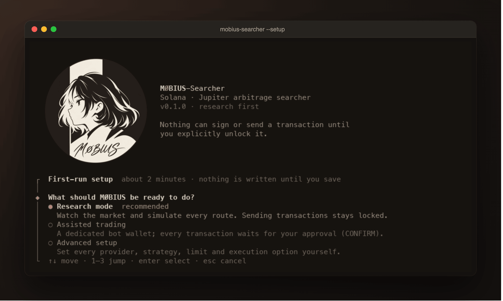

# Usage

## First run

```bash
mobius-searcher
```

On the first interactive launch (no `~/.config/mobius/config.toml` yet) a short
setup runs in the terminal. It asks what MØBIUS should be ready to do:

| Path | What it sets up |
|---|---|
| **Research mode** (recommended) | watch the market and simulate every route; sending stays locked |
| **Assisted trading** | a dedicated bot wallet; every transaction waits for your approval (CONFIRM) — unlocked only by typing `ENABLE CONFIRM` |
| **Advanced setup** | every provider, strategy, limit and execution option |

Nothing is written until you confirm the review at the end. Settings go to
`~/.config/mobius/config.toml`, secrets to `~/.config/mobius/.env`, a new bot
wallet to `~/.config/mobius/wallets/` (`0600`) — never into the repository.
`--setup` reopens it later (it starts from your current settings);
`--skip-setup` bypasses it for automated launches.



## Modes

| Mode | Market data | Transactions assembled and simulated | Signed and sent | Unlocked by |
|---|---|---|---|---|
| **PAPER** (default) | real | yes, on mainnet (`simulateTransaction`) | never | — |
| **CONFIRM** | real | yes | only after you press `y` for each one | `execution.live_enabled = true` + `wallet.keypair_path` + `--mode confirm` |
| **LIVE** | real | yes | automatically, when simulation and risk pass | same as CONFIRM + `--mode live` |

In every mode a transaction is only considered when its simulation shows a
profit after all costs, and the risk engine can refuse it (size, daily loss,
fee reserve, staleness, kill switch). **`K` stops new submissions from any
page.** Read [LIVE_CHECKLIST.md](LIVE_CHECKLIST.md) before CONFIRM or LIVE.

## Command line

| Command | What it does |
|---|---|
| `mobius-searcher` | terminal UI in the configured mode (PAPER by default) |
| `mobius-searcher --mode paper\|confirm\|live` | override the mode for this run |
| `mobius-searcher --headless --duration 3600` | no UI; status lines on stdout, a report at the end |
| `mobius-searcher --doctor` | check config, secrets (names only), proxy and every endpoint; `--mode live` also checks the wallet |
| `mobius-searcher --print-config` | every effective setting and the layer it came from |
| `mobius-searcher --setup` | reopen the setup |
| `mobius-searcher --check-wallet PATH` | validate a private-key file offline and print its public address |
| `mobius-searcher --list-sessions` | recorded sessions |
| `mobius-searcher --report latest` | statistics of a session (`--json` for JSON) |
| `mobius-searcher --replay latest` | the same UI over a recorded session |
| `mobius-searcher --replay ID --snapshot 120x40 --out DIR` | render pages of a session to `.txt` / `.html` |
| `mobius-searcher --db-info` | database size per session |
| `mobius-searcher --prune` | apply the retention policy now ([STORAGE.md](STORAGE.md)) |

Display options: `--glyphs unicode|ascii`, `--color truecolor|ansi256|none`,
`--ascii`, `--no-color`, `--no-mouse`. Other: `--config PATH`, `--db PATH`,
`--scheduler event|round_robin` (A/B comparisons), `--keys "4a<left*30>b"`
(a key script applied at start, for replays and snapshots).

## Terminal UI

| Page | Shows |
|---|---|
| `1` Overview | opportunities, graph workspace, event stream, inspector |
| `2` Markets | exchange-style view: price chart (line or candles, 1s–1D) with VWMA, live price tag and high/low markers; DEX quote book / last trades; open orders, order history, assets, bots; ticker strip |
| `3` Opportunities | every evaluated route and why it was skipped; `⏎` inspects one |
| `4` Graphs | up to 6 stacked metrics with a cursor, A/B markers and a samples table |
| `5` Trades | fills and session PnL |
| `6` Risk | kill switch, limits, why opportunities were not executed |
| `7` System | every connection: state, latency, errors, requests, rate limits; feeds |
| `8` Logs | merged log |

<table>
<tr><td></td><td></td></tr>
<tr><td></td><td></td></tr>
</table>

### Keys

| Key | Action |
|---|---|
| `1`–`8` | pages |
| `Tab` | cycle focus between panels |
| `K` | **kill switch** — stop new trades (any page); `K` again, then `y`, to release |
| `j`/`k`, `↑`/`↓` | select / scroll |
| `⏎` | inspect / detail · `Esc` back to live |
| `←`/`→` | move the cursor (Shift ×10) · `Alt+←/→` pan · `Home`/`End` |
| `a` / `b` / `x` | mark A / B at the cursor, clear — differences in the A/B inspector |
| `[` / `]` | timeframe (Markets page: candle bar 1s–1D) |
| `+` / `-` | add / remove graph metrics |
| `c` | line / candles · `s` box / braille lines |
| `f` | filter opportunities (all · gross>0 · executable · skipped) |
| `p` · `t` · `o` | Markets page: next pair · quote book / last trades · bottom tabs |
| `y` / `n` | approve / decline a pending CONFIRM transaction |
| `?` | keys (with the logo) |
| `q` | quit (graceful; the recording is flushed) |

**Mouse:** click tabs, panels and rows (click the selected opportunity again
to inspect it); click or drag on a chart to move the cursor; right-click a
chart to mark A, then B; the wheel scrolls lists and zooms charts. Releasing
the kill switch and approving CONFIRM trades stay on the keyboard. To select
text, hold your terminal's modifier (usually Shift, Option in iTerm2) while
dragging, or run with `--no-mouse`.

### Terminals

The UI works in any modern terminal. Terminals with an image protocol (kitty
graphics, iTerm2 or sixel) show the real logo; others get a character-cell
rendering of it. See [INSTALL.md](INSTALL.md#terminals) for recommendations.

## Recording, reports and replay

Every session is recorded to a local SQLite database — every evaluation,
including the negative ones and their skip reason. Nothing leaves your machine.

```bash
mobius-searcher --report latest
```

```bash
mobius-searcher --replay latest
```

Old sessions are removed automatically (7 days, 90 days for sessions with
trades, 1 GB cap); see [STORAGE.md](STORAGE.md).
