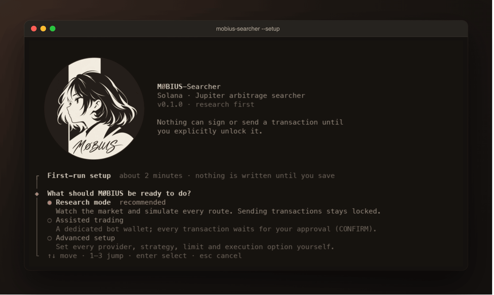
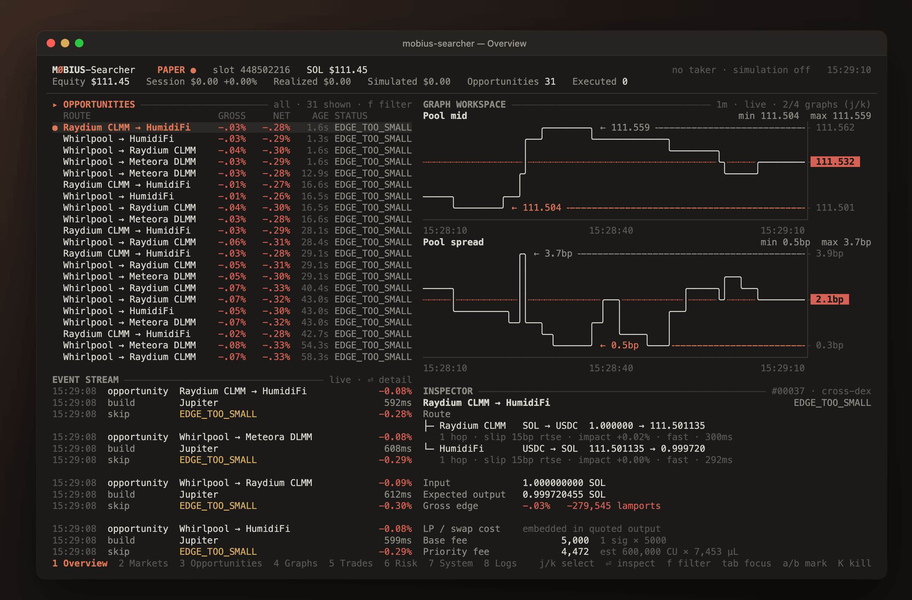
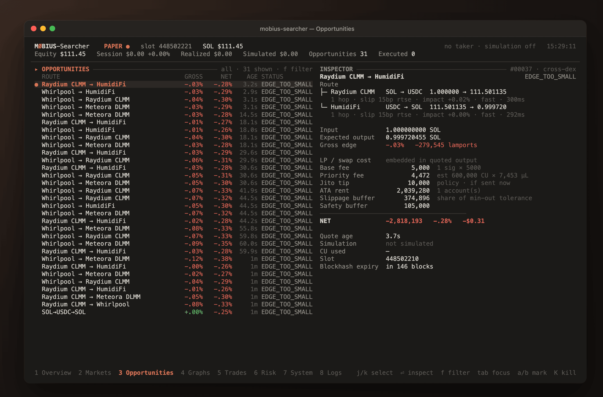
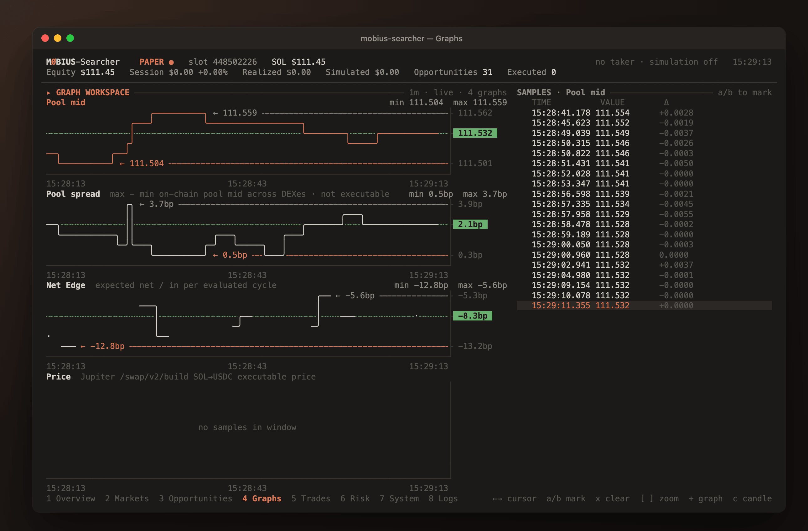
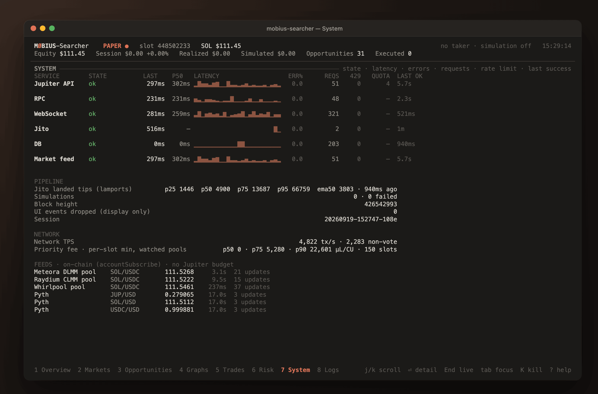

# Usage

## First run

```bash
mobius-searcher
```

On the first interactive launch (no `~/.config/mobius/config.toml` yet) a short
setup runs in the terminal. It asks what MØBIUS should be ready to do:

| Path | What it sets up |
|---|---|
| **Research mode** (recommended) | watch the market and simulate every route; sending stays locked |
| **Assisted trading** | a dedicated bot wallet; every transaction waits for your approval (CONFIRM) — unlocked only by typing `ENABLE CONFIRM` |
| **Advanced setup** | every provider, strategy, limit and execution option |

Nothing is written until you confirm the review at the end. Settings go to
`~/.config/mobius/config.toml`, secrets to `~/.config/mobius/.env`, a new bot
wallet to `~/.config/mobius/wallets/` (`0600`) — never into the repository.
`--setup` reopens it later (it starts from your current settings);
`--skip-setup` bypasses it for automated launches.



## Modes

| Mode | Market data | Transactions assembled and simulated | Signed and sent | Unlocked by |
|---|---|---|---|---|
| **PAPER** (default) | real | yes, on mainnet (`simulateTransaction`) | never | — |
| **CONFIRM** | real | yes | only after you press `y` for each one | `execution.live_enabled = true` + `wallet.keypair_path` + `--mode confirm` |
| **LIVE** | real | yes | automatically, when simulation and risk pass | same as CONFIRM + `--mode live` |

In every mode a transaction is only considered when its simulation meets
the profit thresholds after all costs, and the risk engine can refuse it
(size, daily loss, fee reserve, staleness, kill switch). The thresholds are
yours to set (see [Thresholds](#thresholds)); by default a landed trade
cannot lose money, because the final leg's on-chain minimum output covers
the input, every cost and the minimum profit. **`K` stops new submissions
from any page.** Read [LIVE_CHECKLIST.md](LIVE_CHECKLIST.md) before CONFIRM
or LIVE, and run the [canary](#canary-the-first-real-trade) once first.

## Command line

| Command | What it does |
|---|---|
| `mobius-searcher` | terminal UI in the configured mode (PAPER by default) |
| `mobius-searcher --mode paper\|confirm\|live` | override the mode for this run |
| `mobius-searcher --headless --duration 3600` | no UI; status lines on stdout, a report at the end |
| `mobius-searcher --doctor` | check config, secrets (names only), proxy and every endpoint; `--mode live` also checks the wallet |
| `mobius-searcher --print-config` | every effective setting and the layer it came from |
| `mobius-searcher --setup` | reopen the setup |
| `mobius-searcher --check-wallet PATH` | validate a private-key file offline and print its public address |
| `mobius-searcher --list-sessions` | recorded sessions |
| `mobius-searcher --report latest` | statistics of a session (`--json` for JSON) |
| `mobius-searcher --replay latest` | the same UI over a recorded session |
| `mobius-searcher --replay ID --snapshot 120x40 --out DIR` | render pages of a session to `.txt` / `.html` |
| `mobius-searcher --research [--duration N]` | measurements only: size ladder, cross-chain spreads, DEX lag ([Research](#research)) |
| `mobius-searcher --research-report [RUN\|latest\|all]` | what the research runs recorded, as whole distributions (`--json`) |
| `mobius-searcher --research-pools [--duration N]` | round trips between the watched pools, worked out from the pools' own accounts ([Pools](#pools)); `--research-pools-report` prints every recorded run |
| `mobius-searcher --lab FILE` | rules that hold a position, on paper: live prices bar by bar ([docs/LAB.md](LAB.md)); `--lab-backtest FILE [--days N]` runs them over past candles, `--lab-report` prints the live runs |
| `mobius-searcher --trade FILE` | **real money**: the one rule of FILE with a small budget from the wallet, real SOL/USDC swaps ([docs/TRADE.md](TRADE.md)); needs `acknowledge = "ALLOW LOSS"` in the file and `execution.live_enabled`. `--dry-run` simulates the first swap and sends nothing, `--close` sells what the run holds and ends it |
| `mobius-searcher --research-liquidations [DAYS]` | past lending liquidations read back from chain: what each paid and how long it had been available ([Liquidations](#liquidations)) |
| `mobius-searcher --canary` | one real, loss-bounded trade through the LIVE path, then a reconciliation ([Canary](#canary-the-first-real-trade)) |
| `mobius-searcher --quote WETH/USDC --size 0.5` | price a market on every enabled venue that lists it |
| `mobius-searcher --migrate-config` | move the Solana sections of your config under `[venues.solana]` (asks first) |
| `mobius-searcher --db-info` | database size per session |
| `mobius-searcher --prune` | apply the retention policy now ([STORAGE.md](STORAGE.md)) |

Display options: `--glyphs unicode|ascii`, `--color truecolor|ansi256|none`,
`--ascii`, `--no-color`, `--no-mouse`. Other: `--config PATH`, `--db PATH`,
`--scheduler event|round_robin` (A/B comparisons), `--keys "4a<left*30>b"`
(a key script applied at start, for replays and snapshots).

## Terminal UI

| Page | Shows |
|---|---|
| `1` Overview | opportunities, graph workspace, event stream, inspector |
| `2` Markets | exchange-style view: price chart (line or candles, 1s–1D) with VWMA, live price tag and high/low markers; DEX quote book / last trades; open orders, order history, assets, bots; ticker strip |
| `3` Opportunities | every evaluated route and why it was skipped; `⏎` inspects one |
| `4` Graphs | up to 6 stacked metrics with a cursor, A/B markers and a samples table |
| `5` Trades | fills and session PnL |
| `6` Risk | kill switch, limits, why opportunities were not executed |
| `7` System | every connection: state, latency, errors, requests, rate limits; feeds |
| `8` Logs | merged log |
| `9` Bots | the rules that hold a position, real and paper: what each holds, what it waits for, live candles with the prices it acts at and how they are worked out, what it did. A real one is started, stopped and closed from here ([docs/TRADE.md](TRADE.md#from-the-terminal-ui)) |
| `0` Wallet | what the wallet holds, the address to receive at (with its QR code), what came and went, and sending SOL or USDC to another address ([below](#the-wallet-page)) |

<table>
<tr><td></td><td></td></tr>
<tr><td></td><td></td></tr>
</table>

### Keys

| Key | Action |
|---|---|
| `1`–`9`, `0` | pages |
| `Tab` | cycle focus between panels |
| `K` | **kill switch** — stop new trades (any page); `K` again, then `y`, to release |
| `j`/`k`, `↑`/`↓` | select / scroll |
| `⏎` | inspect / detail (`j`/`k` scroll a long one) · `Esc` back to live |
| `←`/`→` | move the cursor (Shift ×10) · `Alt+←/→` pan · `Home`/`End` |
| `a` / `b` / `x` | mark A / B at the cursor, clear — differences in the A/B inspector |
| `[` / `]` | timeframe (Markets page: candle bar 1s–1D) |
| `+` / `-` | add / remove graph metrics |
| `c` | line / candles · `s` box / braille lines |
| `f` | filter opportunities (all · gross>0 · executable · skipped) |
| `p` · `t` · `o` | Markets page: next pair · quote book / last trades · bottom tabs |
| `y` / `n` | approve / decline a pending CONFIRM transaction |
| `T` | thresholds panel: stage · review · apply ([Thresholds](#thresholds)) |
| `s` / `x` / `c` | Bots page: start the selected bot · stop it · sell what it holds and end it (each asks, `y` does it) |
| `b` · `[` `]` · `v` | Bots page: change the bot's budget · the bar its chart is looked at in (1s–1D) · candles / line |
| `n` · `p` | Bots page: make a new bot · show / hide the paper experiments (hidden until asked for) |
| `s` / `u` · `c` · `r` | Wallet page: send SOL / USDC · copy the address · read the wallet again |
| `?` | keys, by group (with the logo); the footer shows the ones of the page you are on. In Chinese: what the page you are on is, what each part of it means and what each key does |
| `q` | quit (graceful; the recording is flushed) |

**Mouse:** click tabs, panels and rows (click the selected opportunity again
to inspect it); click or drag on a chart to move the cursor; right-click a
chart to mark A, then B; the wheel scrolls lists and zooms charts. Releasing
the kill switch, approving CONFIRM trades and a bot's `y` stay on the keyboard. To select
text, hold your terminal's modifier (usually Shift, Option in iTerm2) while
dragging, or run with `--no-mouse`.

### The Wallet page

Page `0` shows the wallet of `[wallet] pubkey`: its SOL and USDC and what
they are worth, what of it a bot holds (that is part of the balance, and not
offered for sending), and what is free to send once the SOL kept for fees
(`risk.min_wallet_sol_for_fees_lamports`) is left alone. Beside it the
address to receive at, whole and as a QR code; `c` copies it where the
terminal can (OSC 52), otherwise select it with the terminal's modifier
(Shift or Option while dragging). **Solana network only**: from an exchange,
choose the Solana network for the withdrawal. Under it, the last
transactions as they changed the wallet; `⏎` shows one whole, its signature
included.

`s` sends SOL, `u` sends USDC, to another Solana address:

1. Write the address (paste works; only base58 is taken; `↑` `↓` put in one
   it was sent to before) and the amount (`m` fills in all that is free to
   send), `⏎`.
2. The request is checked against the chain and shown back: the amount, the
   address in groups of four, what the chain says of it (a wallet that holds
   something, or an address it has never seen), the network fee (0.000007
   SOL), what opening the recipient's USDC account costs when they have none
   (0.00204 SOL, the chain's deposit), what the wallet holds afterwards, and
   what to know (it would leave less SOL than the program keeps for fees; it
   takes what a bot holds; a bot is trading). What cannot be sent is refused
   here with its reason: an address that is a program's or a token account's,
   more than there is, a first transfer too small for a new address to exist.
3. Type the last four characters of the address, `⏎`. Only then is it
   signed, simulated as signed (any error and nothing is sent) and sent
   until the chain confirms it or it has expired. The page says which, with
   the signature.

A transfer on the chain cannot be taken back; compare the address with where
it should go. Sending needs `execution.live_enabled = true` and `[wallet]
keypair_path` (the page says so when either is missing); the key file is
read only at the moment a confirmed transfer is sent. To try all of it
without money, `python3 scripts/wallet_local.py DIR` prepares a chain of this
machine's own (a throwaway key, test SOL, a USDC that exists only there) and
prints the commands.

### Terminals

The UI works in any modern terminal. Terminals with an image protocol (kitty
graphics, iTerm2 or sixel) show the real logo; others get a character-cell
rendering of it. See [INSTALL.md](INSTALL.md#terminals) for recommendations.

## Thresholds

`T` opens the thresholds panel (keyboard only): minimum profit in lamports,
bp and USD, the on-chain minimum output, slippage reserve, safety buffer,
largest deposit per trade, slippage tolerance, largest trade and daily loss
limit. `⏎` edits the selected value and stages it, `a` shows every staged
change as old → new, `⏎` applies it. The engine checks the change again,
applies it at once, writes a log line per value and saves only those keys in
your config file (comments stay; the previous file is kept as `.bak`).

Settings under which a landed trade *can* lose money — the on-chain minimum
output switched off, or a minimum profit below zero — need you to type
`ALLOW LOSS`. The header then shows **LOSS ALLOWED** on every page until you
change them back.

Deposits — rent locked in accounts a trade leaves created, such as a token
account for a new token — are capital, not a cost: they are shown but not
subtracted from profit, and `profit.max_new_deposit_lamports` caps them.

## Research

```bash
mobius-searcher --research
```

Measurements that decide what is worth building, recorded to
`<data dir>/research.sqlite`. Nothing is signed or sent. It holds the Jupiter
budget while it runs: a trading session started meanwhile is refused, and the
other way round. On macOS it keeps the machine awake (on AC power).

| Measurement | Question |
|---|---|
| Size ladder | the configured routes quoted at 0.01–2 SOL: does a bigger trade change the edge? |
| Cross-chain | ETH and cbBTC bought and sold on Solana (Jupiter) vs Base/Arbitrum (Uniswap v3), after swap fees, Solana fees and gas |
| DEX lag | pool mids vs the OKX/Binance best bid/ask; a gap over `lag_trigger_bps` gets one executable Jupiter quote on that DEX, and control quotes at random times show whether the trigger beats chance |

```bash
mobius-searcher --research-report
```

The report prints whole distributions with the number of samples next to the
number of positive ones, and the caveats next to the numbers: quotes are not
fills, bridging and inventory moves between chains are not included, pool
mids are not executable.

### Pools

```bash
mobius-searcher --research-pools --duration 3600
```

Once a second, reads the watched pools (`[feeds]`: Orca Whirlpool, Raydium
CLMM, Meteora DLMM for SOL/USDC) with the tick and bin arrays around their
price, all at one slot, and works out what selling SOL on one and buying it
back on another returns, for every ordered pair and each size in
`research.pool_sizes_lamports`. The pool math is our own
(`crates/market/src/amm`) and is checked against what the pool programs
themselves pay in swaps simulated on mainnet.

Each snapshot of the Meteora pool is also kept with the exchange price of
that moment (OKX and Binance best bid/ask), and a second report imagines
orders resting in its bins: base token to sell one, two and five bins above
the price, quote token to buy as far below, a new pair every 5 seconds. An
order is filled when the price goes through its whole bin within a minute;
its result is the bin's price with the fee the bin earns, against the
exchange price 0, 5, 15 and 30 seconds later, split by whether the pool was
below or above the exchange when the order went in. This is the maker's side
of the DEX-lag signal; nothing is placed.

No quote API is involved, so this is the market without our latency in it:
whether a gap wider than the two pools' fees ever opens, how wide, and for how
many seconds it stays. It uses no Jupiter budget and can run next to a
trading session. The report is printed when it stops (Ctrl-C or `--duration`);
`--research-pools-report` prints all recorded runs together.

### Liquidations

```bash
mobius-searcher --research-liquidations 30
```

Reads every Morpho Blue liquidation of the last 30 days on Base from the
chain and reports, for each one: what the protocol paid (the incentive at its
oracle price), what the winner spent on gas, who the winner was, and **for how
many blocks the position had been liquidatable when the winner took it**. That
last number is asked of the contract itself, block by block, so there is no
health formula of ours in it. It answers one question: could a liquidator
that watches a public node ever have been first?

It needs no key, uses no Jupiter budget (it can run next to a trading
session), and signs and sends nothing. Events are kept in
`<data dir>/research.sqlite`; a later run only reads the blocks since the
last one. `--json` prints the report as JSON.

The node must serve historical state. The built-in public gateway does; with
`BASE_RPC_URL` set, your own node is used instead.

## Canary: the first real trade

```bash
mobius-searcher --canary
```

Before anything else is trusted with money, send **one** trade through the
real LIVE path and check every lamport of it. The canary runs the normal
engine in CONFIRM mode — each candidate waits for `y` — with one route
(SOL → USDC → SOL), and replaces the profit thresholds with a loss bound
(`canary.max_loss_lamports`, default 0.0005 SOL) that is also written into the
transaction's on-chain minimum output. After the first landed trade the
session ends, the transaction is fetched, and the taker's SOL and USDC
changes are explained by the executed leg outputs, the fee, the tip and any
deposits. The report is printed and kept under `<data dir>/canary/`.

It needs `execution.live_enabled = true`, a keypair, SOL for the trade and
fees, and some USDC: the second leg spends exactly what the first leg was
quoted, and the wallet's USDC covers any difference (`--doctor` shows how
many worst-case differences it covers).

## Recording, reports and replay

Every session is recorded to a local SQLite database — every evaluation,
including the negative ones and their skip reason. Nothing leaves your machine.

```bash
mobius-searcher --report latest
```

```bash
mobius-searcher --replay latest
```

The report's **quote aging** section compares what each simulated leg was
quoted with what it returned, by how old the quote was when the simulation
was sent. Its last line splits the difference in two: what a perfectly fresh
quote would still lose, and what each second of waiting adds. The first is
the pool and the route; the second is the quote API and the queue in front
of it.

Old sessions are removed automatically (7 days, 90 days for sessions with
trades, 1 GB cap); see [STORAGE.md](STORAGE.md).
